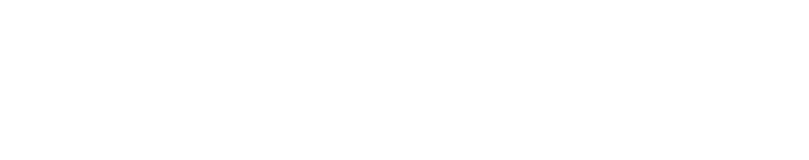

**ProtoFlow is an open-sourced framework for making systems that adapt to how you work.**

ProtoFlow organizes different aspects of your life into a single system tailored to your needs.

## Navigation
- [The problem](#the-problem)
- [The solution](#the-solution)
	- [Systems](#systems)
	- [Protocols](#protocols)
- [The software](#the-software)
- [Examples](#examples)
	- [Focus Protocol](#focus-protocol)
	- [Task System](#task-system)
	- [Calendar System](#calendar-system)
	- [Project System](#project-system)
	- [Capture System](#capture-system)
- [Getting started](#getting-started)
- [Roadmap](#roadmap)

## The problem

I lack a way to keep my life organized and none of the tools I use adapt to how I work. I need a system that organizes information and helps me do the right thing at the right time.

## The solution

A framework for creating interconnected systems and protocols that help you stay organized and do the right thing at the right time.

### Systems

Systems are persistent hubs that manage an area of your life <small>(like a task manager or capture system)</small>. They provide a graphic interface for you to interact with them, and they can interact with each other to create a connected environment.

### Protocols

Protocols perform actions in response to triggers. While systems manage ongoing areas of your life, protocols handle temporary actions triggered by events <small>(like a focus session or a routine)</small>. Multiple instances of the same protocol can be opened at once, and you can interact with each of them through a graphic interface, similar to systems.

## The software

ProtoFlow provides you with the tools you need to create your own systems and protocols:

- An architecture in which a server manages systems and protocols and clients interact with it
- A cross-platform app for clients to interact with their systems and protocols
	- An interface that allows you to open systems and protocols, to close protocol instances and to open new ones
	- An interface for each system and protocol instance in which they define UI elements for users to interact with them
- A C# DSL for creating your own systems and protocols
	- A UI framework to interact with the client app
	- A framework to interact with clients and perform native actions
	- A framework for data serialization

## Examples

This is the system I use to keep my digital life organized. The following examples are included by default:

### Focus Protocol

- **The problem:** I need a reliable way to focus that adapts to how I work.
- **The solution:** A protocol that performs certain setup actions (such as playing focus music), shows a countdown and reminds me of my goal for this session.

### Task System

- **The problem:** I need a way to manage my tasks that adapts to how I work and integrates with other systems.
- **The solution:** A system that allows me to define tasks, their do and due dates, and relate them to projects.

### Calendar System

- **The problem:** I need a way to manage my time that integrates with other systems.
- **The solution:** A system that allows me to define time blocks for working on projects.

### Project System

- **The problem:** I need a structure that allows me to spend my time working on projects that matter to me.
- **The solution:** A system in which I can define project ideas and projects that I'm working on. The system integrates with the Calendar System to allow me to define time blocks for my projects. The system opens focus protocols automatically when time blocks start.

### Capture System

- **The problem:** My ideas often get lost or scattered across many places.
- **The solution:** A centralized system that holds all my ideas, and a protocol that allows me to add new ones. The system allows me to manage all of my ideas, and in the future it could automatically route them to other systems using AI (e.g. "I have to do my Chemistry homework" is routed into the Task System, "I want to build a rocket" is routed to the Project System as a project idea)

## Getting started

### 1. Installing the server

#### Method 1 - For testing purposes (example protocols and systems)

- Download the server for your OS from the [releases tab](TODO)

- On macOS and Linux, give the server execute permissions:

	```bash
	chmod +x Server
	```

#### Method 2 - For development (make your own protocols and systems)

- Install the [.NET 9.0 SDK](https://dotnet.microsoft.com/en-us/download/visual-studio-sdks) (or greater)

- Clone the repository

	```bash
	git clone https://github.com/Mikuel210/ProtoFlow.git
	```

### 2. Installing the client

TODO

### Usage

#### 1. Run the server

- **For method 1**
	- On Windows, run the .exe file
	- On macOS and Linux, run `./Server`

- **For method 2**
	- Run `dotnet run` on the Server directory

> NOTE: You must run the server on the same computer as the client as of now

#### 2. Run the client

TODO

### Next steps

- [Guide](TODO)
- [Documentation](TODO)

## Roadmap

- [ ] Client rewrite
	- [ ] Background support
	- [ ] Mobile support
- [ ] Remote server support
- [ ] UI system overhaul
	- [ ] More elements
	- [ ] Hierarchy system
	- [ ] XML support
- [ ] AI framework
- [ ] File system API
- [ ] Screentime API