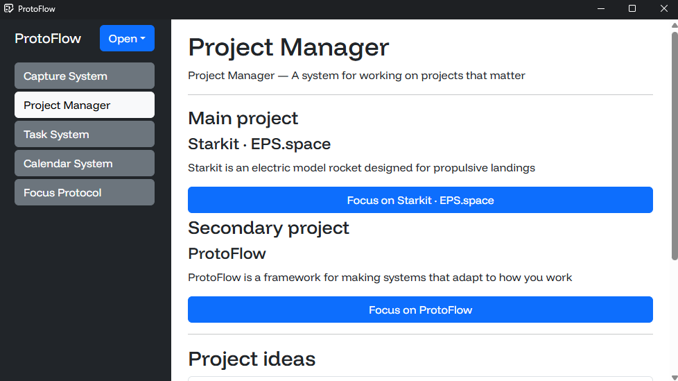

**ProtoFlow is an open-sourced framework for making systems that adapt to how you work.**

ProtoFlow organizes different aspects of your life into a single system tailored to your needs.



## Navigation
- [The problem](#the-problem)
- [The solution](#the-solution)
	- [Systems](#systems)
	- [Protocols](#protocols)
- [The software](#the-software)
- [Examples](#examples)
	- [Focus Protocol](#focus-protocol)
	- [Task System](#task-system)
	- [Calendar System](#calendar-system)
	- [Project Manager](#project-system)
	- [Capture System](#capture-system)
- [Getting started](#getting-started)
- [Roadmap](#roadmap)

## The problem

I lack a way to keep my life organized and none of the tools I use adapt to how I work. I need a system that organizes information and helps me do the right thing at the right time.

## The solution

A framework for creating interconnected systems and protocols that help you stay organized and do the right thing at the right time.

### Systems

Systems are persistent hubs that manage an area of your life <small>(like a task manager or capture system)</small>. They provide a graphic interface for you to interact with them, and they can interact with each other to create a connected environment.

### Protocols

Protocols perform actions in response to triggers. While systems manage ongoing areas of your life, protocols handle temporary actions triggered by events <small>(like a focus session or a routine)</small>. Multiple instances of the same protocol can be opened at once, and you can interact with each of them through a graphic interface, similar to systems.

## The software

ProtoFlow provides you with the tools you need to create your own systems and protocols:

- An architecture in which a server manages systems and protocols and clients interact with it
- A cross-platform app for clients to interact with their systems and protocols
- A C# DSL for creating your own systems and protocols

## Examples

This is the system I use to keep my digital life organized. The following examples are included by default:

### Focus Protocol

- **The problem:** I need a reliable way to focus that adapts to how I work.
- **The solution:** A protocol that performs certain setup actions (such as playing focus music), shows a countdown and reminds me of my goal for this session.

### Task System

- **The problem:** I need a way to manage my tasks that adapts to how I work and integrates with other systems.
- **The solution:** A system that allows me to define tasks, their do and due dates, and relate them to projects.

### Calendar System

- **The problem:** I need a way to manage my time that integrates with other systems.
- **The solution:** A system that allows me to define time blocks for working on projects.

### Project Manager

- **The problem:** I need a structure that allows me to spend my time working on projects that matter to me.
- **The solution:** A system in which I can define project ideas and projects that I'm working on. The system integrates with the Calendar System to allow me to define time blocks for my projects. The system opens focus protocols automatically when time blocks start.

### Capture System

- **The problem:** My ideas often get lost or scattered across many places.
- **The solution:** A centralized system that holds all my ideas and allows me to capture new ones. The system allows me to manage all of my ideas, and in the future it could automatically route them to other systems using AI (e.g. "I have to do my homework" is routed into the Task System, "I want to build a rocket" is routed to the Project Manager as a project idea)

## Getting started

### STEP 1 - Installing the server

#### Method 1: For testing (example protocols and systems)

- Download and unzip the server for your OS from the [releases tab](https://github.com/Mikuel210/ProtoFlow/releases/latest)

- On macOS and Linux, give the server execute permissions:

	```bash
	chmod +x Server
	```

#### Method 2: For development (make your own protocols and systems)

- Install the [.NET 9.0 SDK](https://dotnet.microsoft.com/en-us/download/visual-studio-sdks) (or greater)

- Clone the repository

	```bash
	git clone https://github.com/Mikuel210/ProtoFlow.git
	```
---

### STEP 2 - Installing the client

#### For Windows

- Download and run the installer from the [releases tab](https://github.com/Mikuel210/ProtoFlow/releases/latest)

#### For Linux

- Download and unzip the client from the [releases tab](https://github.com/Mikuel210/ProtoFlow/releases/latest)
- Give the client execute permissions

	```bash
	chmod +x protoflow-client
	```

#### For macOS and others

- Install [Node.js LTS](https://nodejs.org/en/download)

- Clone the repository

	```bash
	git clone https://github.com/Mikuel210/ProtoFlow.git
	```

- Install the required packages

	On the `client` directory:

	```bash
	npm install
	```
---

### USAGE

#### 1. Run the server

- **For method 1**
	- On Windows, run `Server.exe`
	- On macOS and Linux, run `./Server`

- **For method 2**
	- Run `dotnet run` on the `Server` directory

#### 2. Run the client

- **For Windows**
	- Run the client from the start menu shortcut or the desktop icon

- **For Linux**
	- Run `./protoflow-client`

- **For macOS and others**
	- Run `npm start` on the `client` directory

**Notes**

- Always start the client while the server is running
- Restarting the server will require restarting the client as well
- As of now, you must run the client on the same computer as the server

### Next steps

#### How to use the example protocols and systems

- **Capture System:** Write down ideas, notes, or thoughts. Tick them off once processed.
- **Project Manager:** Organize your work by logging project ideas and choosing a main and secondary project. Projects can connect with your tasks and time blocks.
- **Task System:** Create tasks with a do date (when you want to work on them) and an optional due date. Tasks can be linked to projects.
- **Focus Protocol:** Pick a task and run a timed focus session. You can also play music while you work.
- **Calendar System:** Plan your week by creating recurring time blocks. If a block is linked to a project, it will automatically open a Focus Protocol when the time comes for you to work on it.

#### How to develop your own protocols and systems

See the [ProtoFlow Guide](documentation/GUIDE.md)

## Roadmap

- [ ] Client rewrite
	- [ ] Support for running on background
	- [ ] Mobile support
- [ ] Remote server support
- [ ] UI system overhaul
	- [ ] More elements
	- [ ] Hierarchy system
	- [ ] XML support
- [ ] File system API
- [ ] AI framework
- [ ] Screentime API

---

Made with ❤️ for Clutter thanks to Hack Club