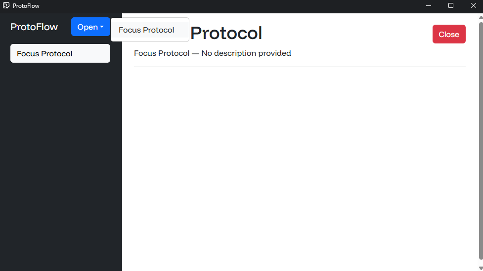

This guide will walk you through creating your first protocol for ProtoFlow. At the end of this guide, you will have made a simple Focus Protocol to help you stay organized.

## Navigation

- [Protocol setup](#protocol-setup)
- [Adding metadata](#adding-metadata)
- [Adding UI elements](#adding-ui-elements)
- [Interacting with clients](#interacting-with-clients)
- [Interacting with the Core](#interacting-with-the-core)
    - [Properties](#properties)
    - [Instance management](#instance-management)
    - [Instance metadata](#instance-metadata)
- [Adding focus music](#adding-focus-music)
- [Finished code](#finished-code)
- [Other resources](#other-resources)

---

We're going to make a simple protocol to help you focus. The Focus Protocol first asks the user for a session goal and duration. During the focus session, the protocol displays the goal and the remaining time, and the protocol plays focus music. When the session ends, the protocol shows a notification and closes itself.

## Protocol setup

Protocols and systems live inside the `Plugins` C# project inside the ProtoFlow solution. To create a new protocol, create a new file in this directory called `FocusProtocol.cs` and define a new class that inherits from `ProtocolInstance`:

```csharp
using SDK;
using SDK.InstanceTools;

namespace Plugins;

public class FocusProtocol : ProtocolInstance;
```

Every concept we're going to cover in this guide works the same for developing systems, except systems must inherit from the `SystemInstance` class.

---

Let's test if our new protocol shows up in the client. Run `dotnet build` on the `Plugins` directory to compile your protocols and systems. You'll have to do this every time you make changes to your setup. Next, start the server by running `dotnet run` on the `Server` project inside the ProtoFlow solution. You should be able to open your new protocol from the client now.



## Adding metadata

Metadata tells ProtoFlow how it should treat your protocols or systems. Metadata is implemented in the form of attributes that you add to your protocol and system classes. Let's take a look at some of the most important attributes.

- `InstanceName(string name)` sets a name for the system or protocol. The instance name defaults to the class name with spaces between words.
- `InstanceDescription(string description)` sets a description for the system or protocol.
- `ShowOnClient(bool showOnClient)` tells whether a system or protocol should be shown on the client.
- `CanClientOpen(bool canClientOpen)` tells whether or not clients can open the protocol.
- `CanClientClose(bool canClientClose)` tells whether or not clients can close the protocol.
- `NotifyOnOpen(bool notifyOnOpen)` tells whether clients should receive a notification when the protocol is opened.

---

For our protocol, we'll only override the description.

```csharp
[InstanceDescription("A protocol for focusing on stuff that matters")]
public class FocusProtocol : ProtocolInstance;
```

## Adding UI elements

Instances can define their own UI for users to interact with them. The following UI elements are available:

- `Heading(string text = "", int level = 1)`: Represents a heading that takes a text and a level from 1 to 6.
- `Paragraph(string text = "")`: Represents a paragraph.
- `HorizontalRule`: Represents a separator.
- `Input(InputType inputType = InputType.Text, string text = "", string placeholder = "")`: Represents an input field, which can either be of type `InputType.Text` or `InputType.Number`. Inputs can have a default text and a placeholder. You can subscribe to the `OnValueChanged` event and you can read the user input at any time from the `Text` property.
- `Button(string text = "")`: Represents a button that takes a text content. You can handle clicks by subscribing to the `OnClick` event.
- `Checkbox(string text = "")`: Represents a checkbox that takes a text label. You can check the status of the checkbox using the `Checked` property, and you can subscribe to the `OnChecked`, `OnUnchecked` and `OnStateChanged` events to detect changes.

---

Let's make a user interface that asks for a session goal and duration before starting the focus session. To do this, we have to add new UI elements when the protocol is opened. You can override the `Open` method to perform setup actions such as these. A `Loop` method that runs on every server tick is also available, and you can override the `Close` method as well for protocols to run logic before closing.

```csharp
public class FocusProtocol : ProtocolInstance {

    public override void Open() {
        // Initialize UI
        InstanceUI.Add(new Input(Input.InputType.Text, placeholder: "Session goal"));
        InstanceUI.Add(new Input(Input.InputType.Number, placeholder: "Focus minutes"));
        InstanceUI.Add(new Button("Start session"));
    }

}
```

In the previous code, we've added two `Input` elements and one `Button` element to the protocol UI. `InstanceUI` is a collection of `UIElement`s. All elements on the collection are automatically shown on clients. 

However, if we want to access the properties of the elements we've added <small>(such as the text the user has input, or the click event for the button)</small> we will have to keep a reference to them:


```csharp
public class FocusProtocol : ProtocolInstance {

    private Input _sessionGoalInput;
    private Input _focusMinutesInput;
    private Button _startSessionButton;

    public override void Open() {
        // Create UI elements
        _sessionGoalInput = new Input(Input.InputType.Text, placeholder: "Session goal");
        _focusMinutesInput = new Input(Input.InputType.Number, placeholder: "Focus minutes");
        _startSessionButton = new Button("Start session");

        // Add elements to InstanceUI
        InstanceUI.Add(_sessionGoalInput);
        InstanceUI.Add(_focusMinutesInput);
        InstanceUI.Add(_startSessionButton);
    }

}
```

Let's listen to the click event of our button to start the focus session. When the button is clicked, all UI elements are removed and new ones are added to show the session goal and remaining time.

```csharp
public class FocusProtocol : ProtocolInstance {

    private Input _sessionGoalInput;
    private Input _focusMinutesInput;
    private Button _startSessionButton;

    private bool _sessionStarted;
    private Heading _timeHeading;
    private TimeSpan _focusDuration;
    private DateTime _startTime;

    public override void Open() {
        // Create UI elements
        _sessionGoalInput = new Input(Input.InputType.Text, placeholder: "Session goal");
        _focusMinutesInput = new Input(Input.InputType.Number, placeholder: "Focus minutes");
        _startSessionButton = new Button("Start session");

        // Add elements to InstanceUI
        InstanceUI.Add(_sessionGoalInput);
        InstanceUI.Add(_focusMinutesInput);
        InstanceUI.Add(_startSessionButton);

        // Listen to the click event of the button
        _startSessionButton.OnClick += StartSession;
    }

    private void StartSession() {
        _sessionStarted = true;
        _startTime = DateTime.Now;

        // Get focus minutes from user input and set focus duration
        if (!int.TryParse(_focusMinutesInput.Text, out int minutes)) return;
        _focusDuration = TimeSpan.FromMinutes(minutes);

        // Clear UI and add new elements
        InstanceUI.Clear();

        string sessionGoal = _sessionGoalInput.Text;
        InstanceUI.Add(new Heading(sessionGoal, 2));

        _timeHeading = new Heading(level: 4);
        InstanceUI.Add(_timeHeading);
    }

}
```

The previous code listened to the button `OnClick` event to start the focus session. Then, it retrieved the session goal and focus duration from the `Text` property in `Input`s. Finally it used `InstanceUI.Clear()` to remove all existing UI elements and it added new ones.

Now, let's make the time Heading update continuously to show the remaining focus time. To do that, you can override the `Loop` method.

```csharp
public override void Loop() {
    if (!_sessionStarted) return;

    var elapsed = DateTime.Now - _startTime;
    var timeLeft = _focusDuration - elapsed;
    
    _timeHeading.Text = timeLeft.ToString();
}
```

## Interacting with clients

The `Client` class represents a connected client and provides helpers to interact with it. Some useful members you can use are:

- `PlatformType Platform { get; }`: Represents the platform of the client (Windows, MacOS or Linux).
- `Instance? OpenInstance { get; }`: Represents the instance the client is focusing on.
- `static Client? FromPlatform(PlatformType platform)`: Returns the first client that matches the provided platform.
- `void ShowNotification(string title, string body = "")`: Shows a native notification on the client.

---

Let's make our protocol show a notification when the session ends:

```csharp
public override void Loop() {
    if (!_sessionStarted) return;

    TimeSpan elapsed = DateTime.Now - _startTime;
    TimeSpan timeLeft = _focusDuration - elapsed;
    
    _timeHeading.Text = timeLeft.ToString();

    if (timeLeft > TimeSpan.Zero) return;

    // Focus session has ended
    foreach (Client client in Server.Clients)
        client.ShowNotification("Focus session ended", "Take a break now");
}
```

In the previous code, we have iterated through every connected client, listed in `Server.Clients`. On each of them, we have called the `ShowNotification` method.

## Interacting with the Core

The `Core` static class is the main API that plugins use to manage instances and retrieve metadata. Some useful members you can use are:

### Properties

- `static List<Type> InstanceTypes { get; }`: Represents all loaded instance types.
- `static List<Instance> OpenInstances { get; }`: Represents all open instances (both systems and protocols).

### Instance management

- `static Instance Open(Type instanceType)`: Opens and returns a new protocol from the provided type. A generic helper is included.
- `static Instance OpenFromName(string name)`: Opens and returns a new protocol from a human-readable name, either gotten from the `InstanceName` attribute or, if missing, the human-readable equivalent of the instance type.
- `static Instance OpenFromTypename(string name)`: Opens and returns a new protocol from the name of its type
- `static List<Instance> GetOpenInstances(Type instanceType)`: Returns a list of all open instances matching the provided type. A generic helper is included.
- `static Instance? GetOpenInstance(Type instanceType)`: Returns the first instance matching the provided type, or `null` if there are none. A generic helper is included.
- `static Instance GetSystemInstance(Type instanceType)`: Returns the instance of the provided system type. An exception is thrown if the system is not initialized yet. A generic helper is included.
- `static void Close(Instance instance)`: Closes an open instance.

### Instance metadata

All methods for retreiving instance metadata include a generic helper and an overload that takes an instance.

- `static string GetInstanceName(Type instanceType)`: Gets the human-readable name of the instance type (from the `InstanceName` attribute, or the human-readable version of the type name if missing).
- `static string GetInstanceDescription(Type instanceType)`: Gets the instance description from the `InstanceDescription` attribute (`"No description provided"` if missing).
- `static InstanceCategory GetInstanceCategory(Type instanceType)`: Gets the instance category of the given type (`InstanceCategory.System` or `InstanceCategory.Protocol).

Methods for getting the `CanClientOpen`, `CanClientClose`, `NotifyOnOpen` and `ShowOnClient` attributes are also available.

---

For our protocol, we're going to use the `Close` method `Core` class to close the protocol when the focus session ends:


```csharp
public override void Loop() {
    if (!_sessionStarted) return;

    TimeSpan elapsed = DateTime.Now - _startTime;
    TimeSpan timeLeft = _focusDuration - elapsed;
    
    _timeHeading.Text = timeLeft.ToString();

    if (timeLeft > TimeSpan.Zero) return;

    // Focus session has ended
    foreach (Client client in Server.Clients)
        client.ShowNotification("Focus session ended", "Take a break now");
    
    Core.Close(this);
}
```

## Adding focus music

The `Audio` class plays an audio on one or multiple clients. Audios must be constructed from a client or a list of clients and an audio URL. `Play`, `Pause` and `Stop` methods are available for them. All audios must be registered on the `InstanceAudio` of the current instance.

---

To add focus music, we have to create an `Audio` object, register it on `InstanceAudio` and call the `Play` method on it.

```csharp
private void StartSession() {
    _sessionStarted = true;
    _startTime = DateTime.Now;

    // Get focus minutes from user input and set focus duration
    if (!int.TryParse(_focusMinutesInput.Text, out int minutes)) return;
    _focusDuration = TimeSpan.FromMinutes(minutes);

    // Clear UI and add new elements
    InstanceUI.Clear();

    string sessionGoal = _sessionGoalInput.Text;
    InstanceUI.Add(new Heading(sessionGoal, 2));

    _timeHeading = new Heading(level: 4);
    InstanceUI.Add(_timeHeading);

    // Play music
    Audio music = new Audio(Server.Clients, "https://audiohosting.netlify.app/WintergatanLive.mp3");
    InstanceAudio.Register(music);

    music.Play();
}
```

## Finished code

```csharp
using SDK;
using SDK.InstanceTools;

namespace Plugins;

[InstanceDescription("A protocol for focusing on stuff that matters")]
public class FocusProtocol : ProtocolInstance {

    private Input _sessionGoalInput;
    private Input _focusMinutesInput;
    private Button _startSessionButton;

    private bool _sessionStarted;
    private Heading _timeHeading;
    private TimeSpan _focusDuration;
    private DateTime _startTime;

    public override void Open() {
        // Create UI elements
        _sessionGoalInput = new Input(Input.InputType.Text, placeholder: "Session goal");
        _focusMinutesInput = new Input(Input.InputType.Number, placeholder: "Focus minutes");
        _startSessionButton = new Button("Start session");

        // Add elements to InstanceUI
        InstanceUI.Add(_sessionGoalInput);
        InstanceUI.Add(_focusMinutesInput);
        InstanceUI.Add(_startSessionButton);

        // Listen to the click event of the button
        _startSessionButton.OnClick += StartSession;
    }

    private void StartSession() {
        _sessionStarted = true;
        _startTime = DateTime.Now;

        // Get focus minutes from user input and set focus duration
        if (!int.TryParse(_focusMinutesInput.Text, out int minutes)) return;
        _focusDuration = TimeSpan.FromMinutes(minutes);

        // Clear UI and add new elements
        InstanceUI.Clear();

        string sessionGoal = _sessionGoalInput.Text;
        InstanceUI.Add(new Heading(sessionGoal, 2));

        _timeHeading = new Heading(level: 4);
        InstanceUI.Add(_timeHeading);

        // Play music
        Audio music = new Audio(Server.Clients, "https://audiohosting.netlify.app/WintergatanLive.mp3");
        InstanceAudio.Register(music);

        music.Play();
    }

    public override void Loop() {
        if (!_sessionStarted) return;

        TimeSpan elapsed = DateTime.Now - _startTime;
        TimeSpan timeLeft = _focusDuration - elapsed;
        
        _timeHeading.Text = timeLeft.ToString();

        if (timeLeft > TimeSpan.Zero) return;

        // Focus session has ended
        foreach (Client client in Server.Clients)
            client.ShowNotification("Focus session ended", "Take a break now");
        
        Core.Close(this);
    }

}
```

## Other resources

### Instance storage

Add the `InstanceStorage` attribute to fields or properties of instances to save them through restarts of the server. Note that properties must have a public setter for `InstanceStorage` to work.

### Instance events

The `InstanceEvents` static class contains methods to register for events. Some of the most useful ones are:

- `static void RegisterTimeEvent(TimeSpan time, Days days, Action callback)`: Registers an event at a time of the day on the given days, where `Days` is a set of flags.
- `static void RegisterTimeIntervalEvent(DateTime start, TimeSpan interval, Action callback)`: Runs the callback on every `interval`, from a provided `start` time.
- `static void RegisterInstanceOpenedEvent(Action callback)`: Registers an event to run when any instance is opened.
- `static void RegisterInstanceOpenedEvent(Type instanceType, Action callback)`: Registers an event to run when an instance of the provided type is opened.
- `static void RegisterInstanceClosedEvent(Action callback)`: Registers an event to run when any instance is closed.
- `static void RegisterInstanceClosedEvent(Type instanceType, Action callback)`: Registers an event to run when an instance of the provided type is closed.